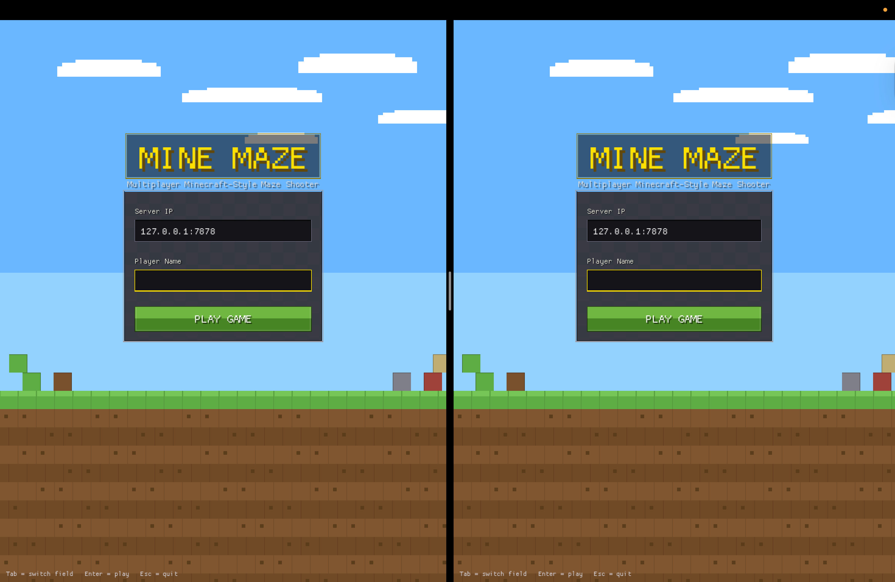

# Multiplayer FPS — Maze Wars

A multiplayer first-person shooter inspired by **Maze Wars**, built in Rust with a client–server architecture over UDP.



## Architecture

| Crate    | Description                                  |
| -------- | -------------------------------------------- |
| `shared` | Protocol definitions, UDP socket abstraction |
| `server` | Authoritative game server                    |
| `client` | Game client with prediction & rendering      |

## Requirements

- **Rust** 1.70+ (install via [rustup](https://rustup.rs))

## Building

```bash
cargo build
```

## Running

This is a workspace with two binaries. You must specify which one to run:

```bash
# Terminal 1 — Start the server
RUST_LOG=info cargo run --bin server

# Terminal 2 — Start a client
RUST_LOG=info cargo run --bin client
```

> **Windows (PowerShell):** set the env var first:
>
> ```powershellc
> $env:RUST_LOG="info"; cargo run --bin server
> $env:RUST_LOG="info"; cargo run --bin client
> ```

## Project Roadmap

- [x] Phase 1 — Project Skeleton
- [x] Phase 2 — UDP Communication Layer
- [x] Phase 3 — Server Authoritative Game Core
- [x] Phase 4 — Client Prediction & Interpolation
- [x] Phase 5 — Maze Generation
- [x] Phase 6 — Rendering Engine
- [x] Phase 7 — Shooting & Hit Detection
- [ ] Phase 8 — Optimization & Stability

## License

This project is for educational purposes.
